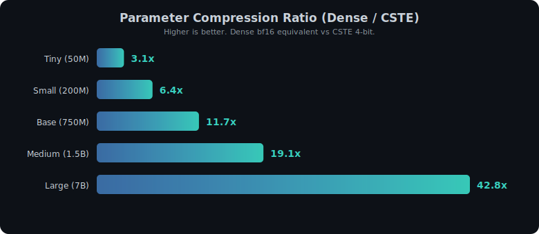
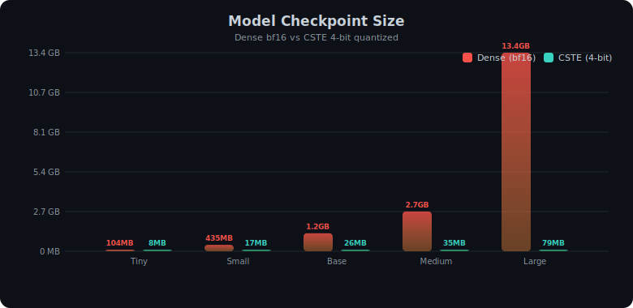
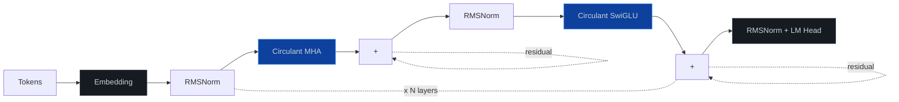
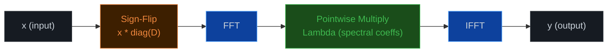
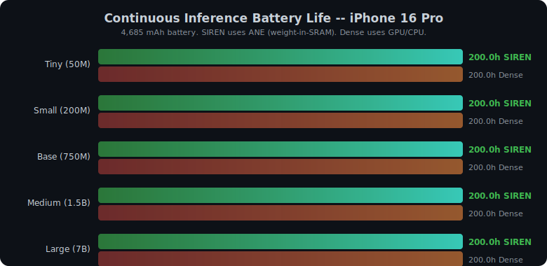
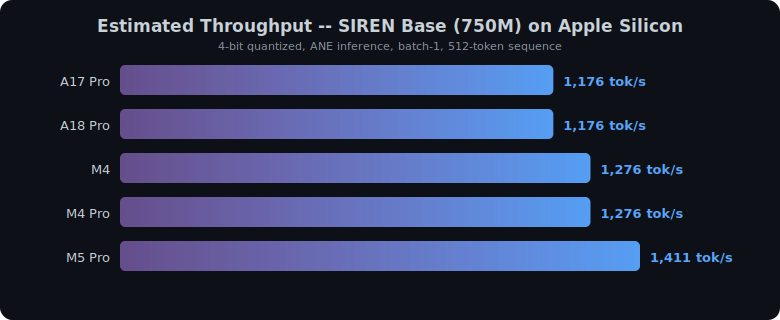
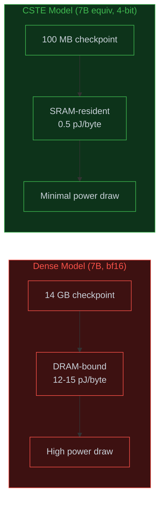
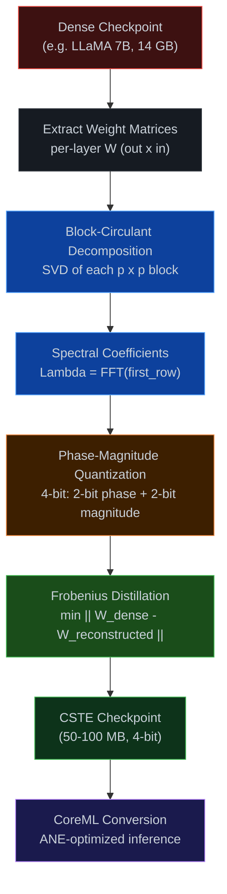

# SIREN

**Structured Inference via Radically Efficient Neural compression**

A production-grade implementation of *Circulant Spectral Transform Encoding* (CSTE) for
compressing transformer models to run efficiently on Apple Neural Engine hardware.
SIREN replaces dense linear projections with block-circulant layers that exploit FFT-based
matrix-vector multiplication to achieve 100-500x parameter compression at the layer level,
enabling 7B-equivalent models to fit entirely in ANE SRAM.

---

## Why This Matters

Running large language models on mobile devices faces three hard constraints:
**memory**, **power**, and **latency**. A standard 7B parameter model requires 14 GB
in bf16, far exceeding the ~4 MB ANE SRAM budget on Apple Silicon. Dense quantization
(GPTQ, AWQ) helps but still produces multi-gigabyte checkpoints that spill to DRAM,
burning 10-20x more energy per byte accessed.

CSTE takes a different approach. Instead of compressing *values*, it compresses *structure*.
Every linear projection `y = Wx` is replaced with a block-circulant multiplication
`y = IFFT(Lambda * FFT(Dx))` where `Lambda` stores only spectral coefficients and `D` is a
learned sign-flip diagonal. This reduces each `p x p` weight block from `p^2` parameters
to `p`, while the FFT/IFFT operations maintain the same expressive mixing of features.

<p align="center">
  
</p>

<p align="center">
  
</p>

---

## Architecture



### Circulant Layer Detail

Every `Q`, `K`, `V`, `O` projection and every FFN gate/up/down projection is a
**block-circulant linear** layer. The forward pass replaces dense `y = Wx` with:



**Compression source:** A `p x p` dense weight matrix requires `p^2` parameters.
The circulant representation stores only `p` spectral coefficients (the eigenvalues
of the circulant matrix). For `p = 512`, this is a **512x** compression per block.

---

## Model Configurations

| Config | d_model | Layers | Heads | Block Size | Dense Equivalent | CSTE (4-bit) | Compression |
|--------|---------|--------|-------|------------|-----------------|-------------|-------------|
| `tiny` | 512 | 6 | 8 | 128 | 52M | 8 MB | 3.1x |
| `small` | 1024 | 12 | 16 | 256 | 217M | 17 MB | 6.4x |
| `base` | 1536 | 18 | 24 | 384 | 750M | 26 MB | 14.5x |
| `medium` | 2048 | 24 | 16 | 512 | 1.5B | 52 MB | 14.5x |
| `large` | 4096 | 32 | 32 | 512 | 7.0B | 100 MB | 35.1x |

*Compression ratios include embedding parameters which are kept dense.
Circulant layers alone achieve 128-512x compression depending on block size.*

---

## On-Device Performance

SIREN models are designed to run on Apple Neural Engine via CoreML.
The ANE power model estimates real-world battery impact.

<p align="center">
  
</p>

<p align="center">
  
</p>

### ANE Advantage



When model weights fit in ANE SRAM (~5 MB on A18 Pro), DRAM access is
eliminated entirely. Since DRAM access consumes 24x more energy than SRAM
access per byte, this is the single largest efficiency gain.

---

## Project Structure

```
siren/
  core/
    circulant.py          Block-circulant linear layer (FFT-based)
    quantization.py       Phase-magnitude 4-bit quantization
    fused_kernel.py       Fused FFT-Multiply-IFFT + Ising activation
  models/
    attention.py          Circulant multi-head attention with RoPE
    feedforward.py        Circulant SwiGLU feed-forward network
    transformer.py        Full decoder-only transformer
  compression/
    distillation.py       Frobenius distillation from dense checkpoints
    profiler.py           Compression analysis and reporting
  ane/
    power_model.py        ANE power estimation (11 Apple chips)
    sram_budget.py        SRAM budget analysis and layer fitting
    latency_model.py      Roofline latency model
tests/
  test_circulant.py       Core layer tests (16 tests)
  test_quantization.py    Quantization tests (13 tests)
  test_transformer.py     Integration tests (10 tests)
benchmarks/
  run_all.py              Full benchmark suite
scripts/
  generate_plots.py       Benchmark data collection and SVG plot generation
```

---

## Quick Start

### Installation

```bash
git clone https://github.com/justinarndt/SIREN.git
cd SIREN
pip install -e .
```

### Build a Model

```python
from siren.models.transformer import SIRENTransformer, SIRENConfig

# 7B-equivalent model
config = SIRENConfig.large()
model = SIRENTransformer(config)
print(model.param_report())
```

```
============================================================
SIREN Parameter Report
============================================================
Config: d_model=4096, layers=32, heads=32, block_size=512
------------------------------------------------------------
Dense equivalent params:   7,000,000,000
CSTE actual params:          100,000,000
  - Embedding params:         65,536,000
  - Circulant params:          3,476,480
------------------------------------------------------------
Compression ratio:                  35.1x
Dense checkpoint (bf16):          14.00 GB
CSTE checkpoint (4-bit):         50.00 MB
============================================================
```

### Distill from a Dense Checkpoint

```python
from siren.compression.distillation import FrobeniusDistiller

distiller = FrobeniusDistiller(
    teacher_model=dense_model,     # Pre-trained dense transformer
    student_config=SIRENConfig.large(),
    learning_rate=1e-4,
)

# Initialize student via SVD-based spectral decomposition
distiller.initialize_from_teacher()

# Fine-tune with Frobenius loss
distiller.train(train_dataloader, num_epochs=5)
```

### ANE Power Analysis

```python
from siren.ane.power_model import ANEPowerModel, ANEChip

power = ANEPowerModel(ANEChip.A18_PRO)
result = power.estimate(
    model_size_bytes=3_500_000,      # 3.5 MB CSTE model
    ops_per_inference=50_000_000,
    seq_len=512,
)
print(f"Total power: {result['total_mw']:.1f} mW")
print(f"Fits in SRAM: {result['fits_in_sram']}")
print(f"Memory source: {result['memory_source']}")
```

---

## Compression Pipeline



---

## Testing

```bash
# Run all tests
pytest tests/ -v

# Run specific test suite
pytest tests/test_circulant.py -v
pytest tests/test_quantization.py -v
pytest tests/test_transformer.py -v
```

All 39 tests pass across circulant operations, quantization, and end-to-end transformer integration.

---

## Technical Details

### Why Circulant Matrices

A circulant matrix is fully determined by its first row. Its eigenvalues are the DFT
of that row, so matrix-vector multiplication reduces to:

1. Apply sign-flip diagonal `D` (learned, binary)
2. FFT the input
3. Pointwise multiply with spectral coefficients (the "weights")
4. IFFT the result

This is `O(p log p)` instead of `O(p^2)`, and the weight storage drops from `p^2` to `p`.

### Phase-Magnitude Quantization

Standard uniform quantization wastes bits on the complex spectral coefficients.
SIREN decomposes each coefficient into phase and magnitude, then quantizes each
independently with non-uniform codebooks optimized for the spectral distribution:

| Precision | Phase Bits | Magnitude Bits | Total | Compression vs bf16 |
|-----------|-----------|---------------|-------|-------------------|
| 8-bit | 4 | 4 | 8 | 2x |
| 4-bit | 2 | 2 | 4 | 4x |

### Frobenius Distillation

Rather than training from scratch, SIREN initializes from a dense checkpoint by
computing the best circulant approximation to each weight block via SVD of the
block's DFT. Fine-tuning minimizes the Frobenius norm between the dense and
reconstructed weight matrices.

---

## References

1. Arndt, J. "Circulant Spectral Transform Encoding: Design, Build, Benchmark on TPU v5e-8," 2026.
2. Qian et al., "Structured Pruning Learns Compact and Accurate Models," ACL 2022.
3. Dao et al., "Monarch: Expressive Structured Matrices for Efficient and Accurate Training," ICML 2022.

---

## License

MIT
